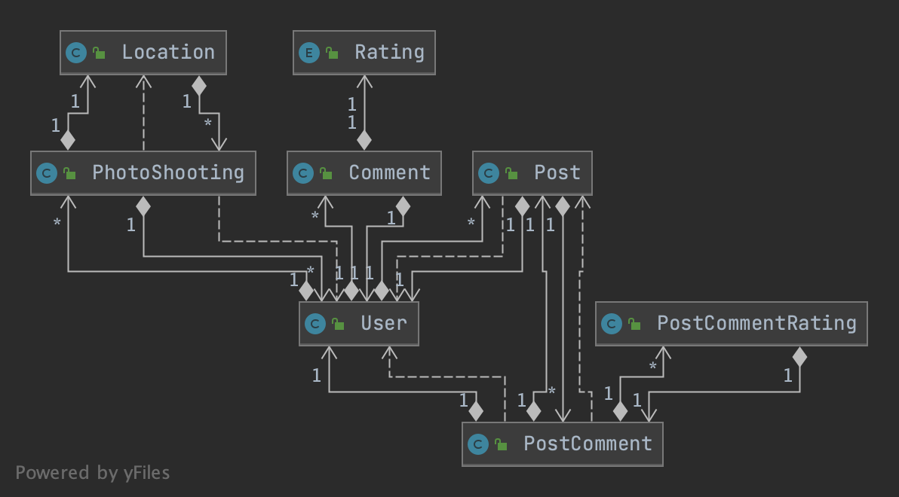

#### Inhaltsverzeichnis

*Contents* +

* Eidesstattliche Erklärung
* Danksagung
* Zusammenfassung
* Einleitung
* Technologie
** Technologie-Analyse
** Technische Sprachen
*** Java
*** TypeScript
*** HTML
*** CSS
*** JPQL
** Werkzeuge
*** InteliJ IDEA
*** WebStorm
* Projektmanagement
** Pflichtenheft

** Meilensteinliste
** Git
* Probleme (technisch)
* Realisierung
** Überblick
** Grund der Aufteilung *?*
** Applikation
*** Architektur *(REST/JSON)?*
* Client
** Plugins/Frameworks
*** Angular
** Auflistung der Fotografen/Models/Locations
** *etc*
* Database
** PostgreSQL
* Schlussfolgerung
* Literaturverzeichnis/Referenzen
* Anhang

#### Beispiel Gliederung

* Deckblatt
* Eidesstattliche Erklärung (pro Schüler/in, handschriftlich unterzeichnet;
siehe Vorlage im Anhang)
* Abstract

Zunächst einmal möchten wir erklären, warum wir denn überhaupt dieses Thema gewählt haben. Der Fortschritt der Technik hat zwei Dinge mit sich gebracht, die unser Thema betreffen. Das erste ist das Internet. Jedem steht es zur Verfügung. Fast jeder verwendet es täglich. Somit ist es für Modells und für Fotografen leicht geworden Ihre Portfolios, ohne viel Aufwand, zu veröffentlichen (z.B. auf Plattformen wie Instagram). Des Weiteren kann sich jeder über das Internet Fähigkeiten wie modeln oder fotografieren autodidaktisch beibringen. Das zweite Problem ist, dass die Kameratechnik schon so billig geworden ist über die Jahre, dass sich jeder eine Kamera leisten kann. Somit entsteht eine gewisse Übersättigung in diesem Bereich. Durch diese Übersättigung entsteht das Problem, dass es immens schwer ist hervorzustehen und gefunden zu werden bzw. ein Netzwerk aufzubauen. Auch Kunden tun sich schwer bei der Suche nach einem Fotografen bzw. einem Model und gehen dann größtenteils zu alteingesessenen Fotografen bzw. Modelagenturen.

All diese Probleme möchten wir mit unserer Plattform lösen. Fotografen und Models wird eine Plattform geboten, auf der man einen Überblick hat über die verschiedenen Social-Media-Kanäle bzw. Webseiten. Außerdem können Kunden und Kollegen die Nutzer auch viel besser finden, da man z.B. nach einer gewissen Stadt filtern kann. Des Weiteren gibt es auch Features wie eine Trending-Seite, die eventuell die Entscheidung leichter macht oder Licht auf neue Personen wirft. Kurz kann man sagen das ein fruchtbarer Boden geschaffen wird für Kollaborationen, Netzwerke, Fotoshootings und vieles mehr. Außerdem wird das Gestalten und Planen von Fotoshootings sehr vereinfacht, indem man Locations mit anderen Teilen kann und diese dann direkt zu seinem Shooting hinzufügen kann. Die Suche nach den Locations wird somit leichter. Last but not least wird der Stress der Planung reduziert, nicht zuletzt mit der Chat-Funktion. Diese löst das Problem, immer alle Kanäle (wie z.B. Mail, Social Media, SMS, dev. Messenger, Anrufe) im Auge behalten zu müssen.

* ev. Danksagung an Personen und Institutionen, die das Entstehen der Diplomarbeit unterstützt haben
* Inhaltsverzeichnis (automatisch erstellen; auf Übersichtlichkeit achten)
* Einleitung (gemeinsam im Team)
* Hauptteil bzw. Inhalt und Ergebnisse (individuelle Leistung muss erkennbar sein –
Name des Verfassers/ der Verfasserin links in der Fußzeile)
* Zusammenfassung (im Team) – Ergebnisse, Erkenntnisse
* Literaturverzeichnis sowie Abbildungsverzeichnis
Auch Tabellen gehören in das Abbildungsverzeichnis.
* Anhang: erläuterndes Bildmaterial, Zeitungsausschnitte, Kooperationsvereinbarungen,
Interviewleitfragen, Dokumentation und Protokolle der einzelnen Teammitglieder (Projektdokumentation). Die Protokolle der Betreuer/innen werden dem Prüfungsprotokoll
beigefügt.

_https://www.hlw-hartberg.at/wp-content/uploads/2018/12/diplomarbeit-leitfaden-2017-1.pdf_

#### Grafiken

image:./images/systemarchitektur.png[SA,title="Systemarchitektur"]

#### Andere Themen

* Näher auf ausgewählte Aspekte eingehen (Ein thema in Verbindung mit der DA auswählen)
* Verwendete Technologien auflisten & beschreiben
** Java
** TS
** Quarkus
*** Dependencies
**** quarkus-resteasy
**** quarkus-junit5
**** rest-assured
**** quarkus-resteasy-jsonb
**** quarkus-elytron-security-jdbc
**** quarkus-hibernate-orm-panache
**** quarkus-jdbc-postgresql
**** quarkus-elytron-security-properties-file
**** quarkus-hibernate-validator
** Angular
* Pattern
* Packages
** boundary
** dto
** entity
** filter
* UI Design
* Datenstruktur
