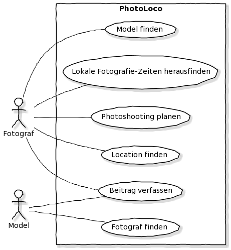

#### Inhaltsverzeichnis

*Contents* +

* Eidesstattliche Erklärung
* Danksagung
* Zusammenfassung
* Einleitung
* Technologie
** Technologie-Analyse
*** Quarkus L
**** Dependencies
***** quarkus-resteasy
***** quarkus-junit5
***** rest-assured
***** quarkus-resteasy-jsonb
***** quarkus-elytron-security-jdbc
***** quarkus-hibernate-orm-panache
***** quarkus-jdbc-postgresql
***** quarkus-elytron-security-properties-file
***** quarkus-hibernate-validator
** Angular L
** Docker F
** Leaflet L
** Times API F
** Geolocation API F
** Technische Sprachen
*** Java L
*** TypeScript L
*** HTML F
*** CSS F
*** SQL F
** Werkzeuge
*** InteliJ IDEA L
* Projektmanagement
** Pflichtenheft F
** Meilensteinliste
** Git
* Probleme (technisch)
* Realisierung
** Überblick
** Grund der Aufteilung *?*
** Applikation
*** Architektur *(REST/JSON)?*
* Client
** Plugins/Frameworks
*** Angular
** Auflistung der Fotografen/Models/Locations
** *etc*
* Database
** PostgreSQL F
* Schlussfolgerung
* Literaturverzeichnis/Referenzen
* Anhang


#### Beispiel Gliederung

* Deckblatt
* Eidesstattliche Erklärung (pro Schüler/in, handschriftlich unterzeichnet;
siehe Vorlage im Anhang)
* Abstract

Zunächst einmal möchten wir erklären, warum wir denn überhaupt dieses Thema gewählt haben. Der Fortschritt der Technik hat zwei Dinge mit sich gebracht, die unser Thema betreffen. Das erste ist das Internet. Jedem steht es zur Verfügung. Fast jeder verwendet es täglich. Somit ist es für Modells und für Fotografen leicht geworden Ihre Portfolios, ohne viel Aufwand, zu veröffentlichen (z.B. auf Plattformen wie Instagram). Des Weiteren kann sich jeder über das Internet Fähigkeiten wie modeln oder fotografieren autodidaktisch beibringen. Das zweite Problem ist, dass die Kameratechnik schon so billig geworden ist über die Jahre, dass sich jeder eine Kamera leisten kann. Somit entsteht eine gewisse Übersättigung in diesem Bereich. Durch diese Übersättigung entsteht das Problem, dass es immens schwer ist hervorzustehen und gefunden zu werden bzw. ein Netzwerk aufzubauen. Auch Kunden tun sich schwer bei der Suche nach einem Fotografen bzw. einem Model und gehen dann größtenteils zu alteingesessenen Fotografen bzw. Modelagenturen.

All diese Probleme möchten wir mit unserer Plattform lösen. Fotografen und Models wird eine Plattform geboten, auf der man einen Überblick hat über die verschiedenen Social-Media-Kanäle bzw. Webseiten. Außerdem können Kunden und Kollegen die Nutzer auch viel besser finden, da man z.B. nach einer gewissen Stadt filtern kann. Des Weiteren gibt es auch Features wie eine Trending-Seite, die eventuell die Entscheidung leichter macht oder Licht auf neue Personen wirft. Kurz kann man sagen das ein fruchtbarer Boden geschaffen wird für Kollaborationen, Netzwerke, Fotoshootings und vieles mehr. Außerdem wird das Gestalten und Planen von Fotoshootings sehr vereinfacht, indem man Locations mit anderen Teilen kann und diese dann direkt zu seinem Shooting hinzufügen kann. Die Suche nach den Locations wird somit leichter. Last but not least wird der Stress der Planung reduziert, nicht zuletzt mit der Chat-Funktion. Diese löst das Problem, immer alle Kanäle (wie z.B. Mail, Social Media, SMS, dev. Messenger, Anrufe) im Auge behalten zu müssen.

* ev. Danksagung an Personen und Institutionen, die das Entstehen der Diplomarbeit unterstützt haben
* Inhaltsverzeichnis (automatisch erstellen; auf Übersichtlichkeit achten)
* Einleitung (gemeinsam im Team)
* Hauptteil bzw. Inhalt und Ergebnisse (individuelle Leistung muss erkennbar sein –
Name des Verfassers/ der Verfasserin links in der Fußzeile)
* Zusammenfassung (im Team) – Ergebnisse, Erkenntnisse
* Literaturverzeichnis sowie Abbildungsverzeichnis
Auch Tabellen gehören in das Abbildungsverzeichnis.
* Anhang: erläuterndes Bildmaterial, Zeitungsausschnitte, Kooperationsvereinbarungen,
Interviewleitfragen, Dokumentation und Protokolle der einzelnen Teammitglieder (Projektdokumentation). Die Protokolle der Betreuer/innen werden dem Prüfungsprotokoll
beigefügt.

_https://www.hlw-hartberg.at/wp-content/uploads/2018/12/diplomarbeit-leitfaden-2017-1.pdf_

#### Grafiken


image:./images/systemarchitektur.png[SA,title="Systemarchitektur"]
image:./images/EntityUML.png[Entities,title="Entities"]

#### Andere Themen

* Näher auf ausgewählte Aspekte eingehen (Ein thema in Verbindung mit der DA auswählen)
* Pattern L,F
* Packages
** boundary
** dto
** entity
** filter
* UI Design F
* Datenstruktur F

== Technologien

=== Technologie-Analyse

==== Quarkus

=== Angular
Für das Frontend der Applikation wird das Webapplikationsframework Angular verwendet. Es ist eine Plattform, die für die Entwicklung von Client Applikationen mittels Web-Technologien HTML, TypeScript und CSS.

Angular umfasst:

* Module
* Komponenten
* Templates
* Data Bindings
* Services

Mithilfe von Module können Funktionalitäten ausgelagert werden. Dies führt zu einem leichtgewichtigeren und performanteren Code. Die Webapplikation wird in Angular mittels Komponenten aufgebaut.
Jede Komponente besteht normalerweise aus:

* einer TypeScript-Datei, in welcher die View-Logik beschrieben ist.
* einer View, welche in HTML umgesetzt ist.
* einem Stylesheet, welches in CSS geschrieben ist.

Die Business-Logik der Applikation wird in Services ausgelagert. Diese lassen sich dann mittels Dependency Injection in Komponenten eingebinden.

Das Aufteilen der Applikation in Komponenten erleichtert das Testen deutlich, da die Komponenten im Normalfall unabhängig voneinander sind.

==== Alternativen
Alternative Frameworks zu Angular sind Vue und React. Beide Frameworks sind leichtgewichtiger und leichter zum Verwenden, da die Frameworks im Vergleich zu Angular JavaScript anstatt TypeScript verwenden. Jedoch wurde entschlossen Angular zu verwenden, weil durch die Verwendung von TypeScript auch die Features der Programmiersprache für die Entwicklung zur Verfügung stehen.

Features von denen Nutzen gemacht wurde, sind zum Beispiel anonyme Funktionen:

[source, typescript]
----
this.route.params.subscribe(
      (params: Params) => {
        this.userService.getUserByInstagramName(params.instagramName).subscribe(value => {
          this.user = value;
        });
      }
    );
----

Wie auch For-Of-Schleifen:

[source, html]
----
<div *ngFor="let comment of getPostCommentsById()" class="col-6 z-de" id="comments">
    <div>
        <b>{{comment.author.username}}</b>
        <p>{{comment.content}}</p>
    </div>
</div>
----

=== Leaflet
Eine bedeutende Funktion dieser Arbeit ist das Teilen und Finden von Foto-Locations. Für eine übersichtliche Darstellung wird die opensource Javascript-Library Leaflet verwendet. Leaflet ermöglicht es dynamische Onlinekarten zu erstellen. Damit ist für den Nutzer eine klare Übersicht, über alle Location auf einer interaktiven Karte gegeben. Im Vergleich zu Alternativen zur Darstellung von Karten wie OpenLayers oder Google Maps ist Leaflet eine leichtgewichtige JavaScript-Bibliothek ist, die aber Features unterstützt, die für dieses Projekt gebraucht werden.


== Projektmanagement

=== Git
Beim Programmieren können folgende Anforderungen vorkommen:

**** Die Codebasis muss regelmäßig gesichert werden.
**** Protokollierungen von Änderungen.
**** Der Entwickler möchte Zugriff auf ältere Versionen seines Programms haben.
**** Beim Entwickeln eines Softwareprodukts im Team braucht jedes Teammitglied Zugriff auf den Sourcecode.
**** Teammitglieder arbeiten oft gleichzeitig an denselben Sourcecode-Files. Sämtliche Änderungen müssen in die Codebasis eingepflegt werden.
**** Separates Entwickeln von neuen Features, bis diese fehlerfrei sind und anschließendes Einfügen dieser neuen Funktionen in die Codebasis.

Um diese Anforderungen zu erfüllen, wird das verteilte Versionierungssystem Git verwendet.

==== Funktionsweise

Zentrale Versionierungssysteme verwenden ein einziges Repository zur Versionierung. Ein Repository ist ein Projektarchiv, in welches Arbeitsfortschritte dokumentiert werden können.

Git verwendet ein Local Repository und ein Remote Repository. Versionierungssysteme, die so ein Konzept verfolgen, nennt man verteilte oder auch dezentrale Versionierungssystem, da kein zentrales Repository verwendet wird. Jede Person hat ein eigenes Local Repository auf seinem Rechner in dem er seine Arbeitsfortschritte dokumentiert. Auf einem Remote Repository werden dann die Arbeitsfortschritte verschiedenster Local Repositories zusammengefasst und vereint. Vorteil davon ist, dass es keine Konflikte gibt, wenn mehrere Entwickler an derselben Version arbeiten, da jeder sein eigenes Local Repository hat.

Remote Repositories für Git werden von verschiedensten Providern, wie zum Beispiel Github, Bitbucket oder Gitlab zu Verfügung gestellt. Für dieses Projekt fiel die Wahl auf Github.


==== Git-Workflow

Der Aufbau von Git besteht aus einem Working Directory, einer Staging Area, einem Lokalen Repository und einem Remote Repository.


Das Working Directory ist das Arbeitsverzeichnis, in welches sich die Dateien des Softwareprodukts befinden und die Teammitglieder entwickeln.

Die Staging Area ist eine Kopie des Arbeitsverzeichnisses. Mittels `git add` kann entschieden werden, welche Dateien in diese Kopie übertragen werden.

Um Arbeitsfortschritte von der Staging Area in das Local Repository zu übertragen und zu dokumentieren, müssen sogenannte Commits erstellt werden. Ein Commit ist eine Momentaufnahme von Dateien und Verzeichnissen zu einem bestimmten Zeitpunkt. Bei jedem Commit wird eine Notiz hinzugefügt, in der kurz beschrieben wird, was für Änderungen vorgenommen wurden. Einen Commit erstellt man wie folgt:
```
git commit -m "Notiz"
```

Lokale Änderungen werden dann mittels `git push` auf das Remote Repository übertragen.
